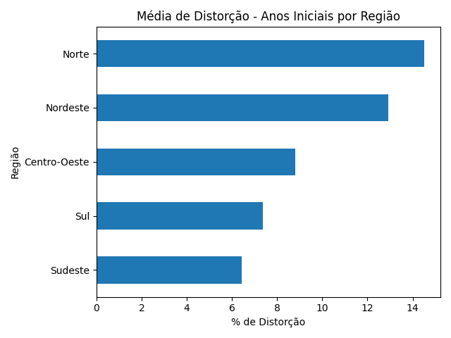
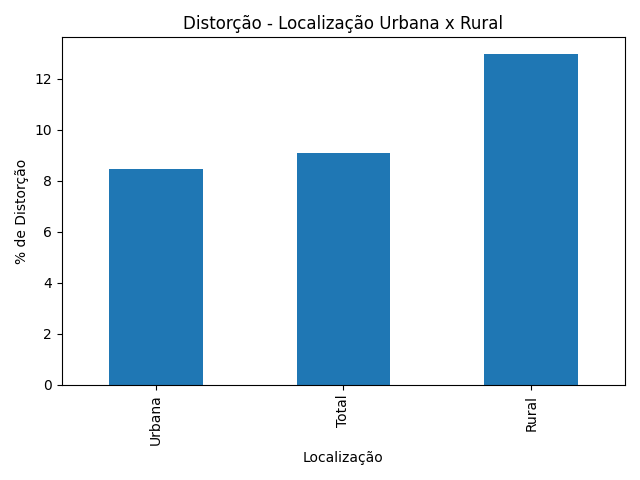
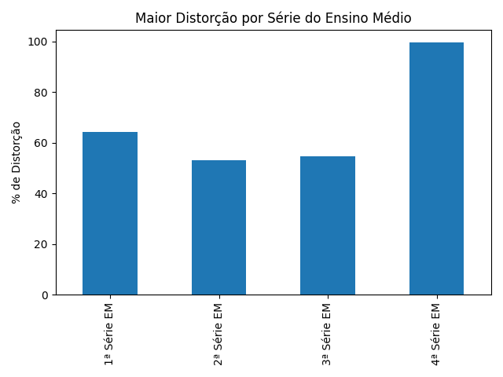

# Distorção idade-série na Educação Brasileira

## Análise de dados com base nas taxas de distorção idade-série do ano de 2020:

**Áreas de ensino analisadas**

- Ensino Fundamental
- Ensino Médio

**Dados analisados, fonte:**

Instituto Nacional de Estudos e Pesquisas Educacionais Anísio Teixeira | Inep

[link para o INPE](https://www.gov.br/inep/pt-br/acesso-a-informacao/dados-abertos/indicadores-educacionais/taxas-de-distorcao-idade-serie)

- Análise por região
- Levantamento de dados e geração de insgths para possíveis politicas públicas referente a Educação.

# Análises Gráficas

## Média por Região

## Localização Urbana x Rural

## Distorção idade-série no Ensino Médio

